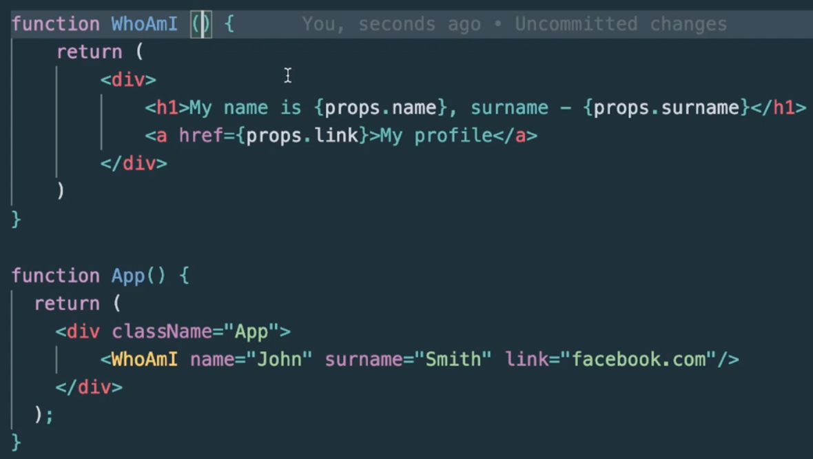
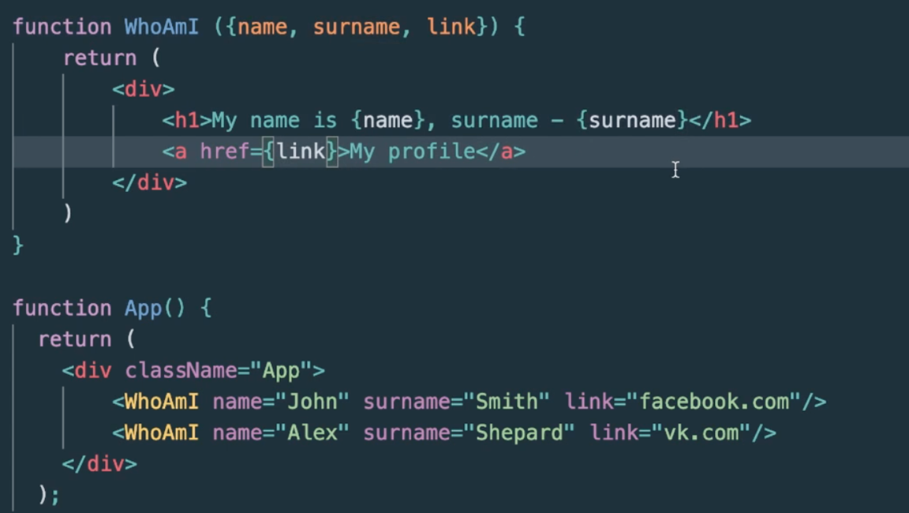
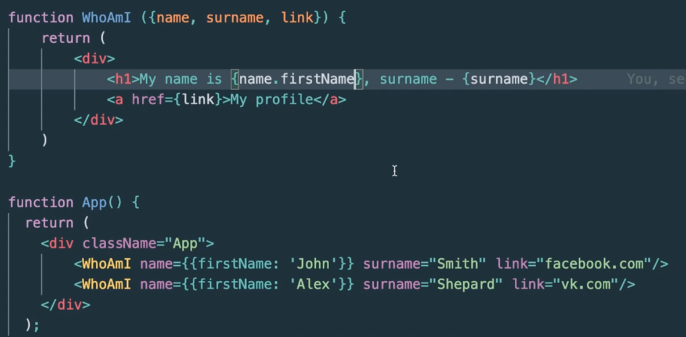

## Свойства компонентов (Props)
Пропс – обьект, со всеми значениям, которые можем в него передать

Пример указания пропсов:

---

Или деструктуризированный обьект:

---

Передаваемые значения атрибутов неизменяемые – для изменения мы должны полностью перерисовать (пересоздать часть кода).
Также можно в качестве атрибутов передавать обьект (или функцию):

