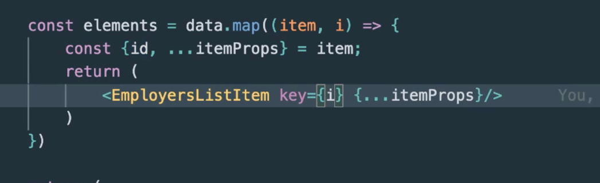
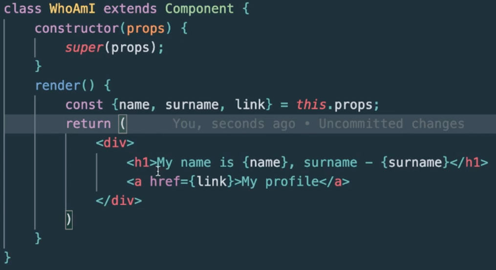
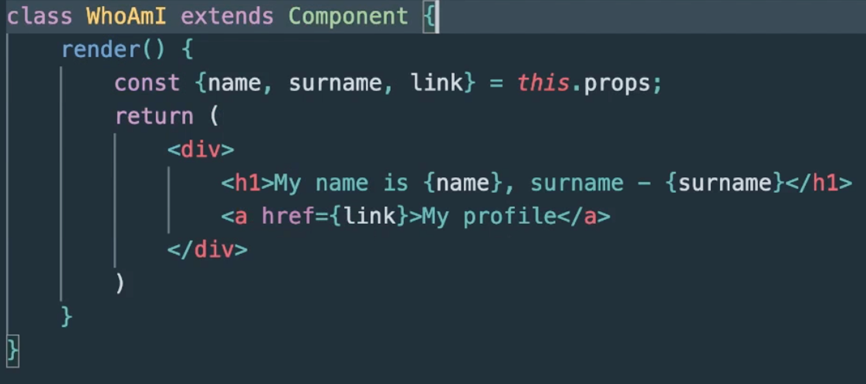
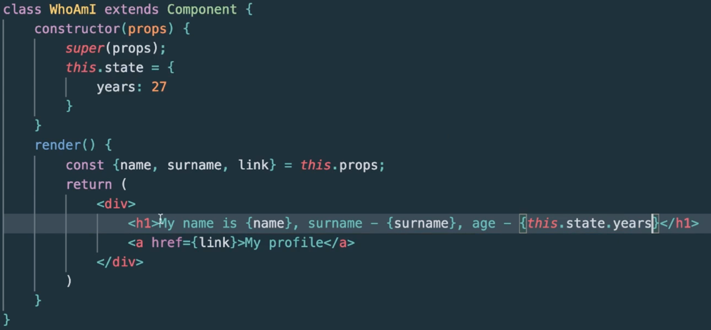
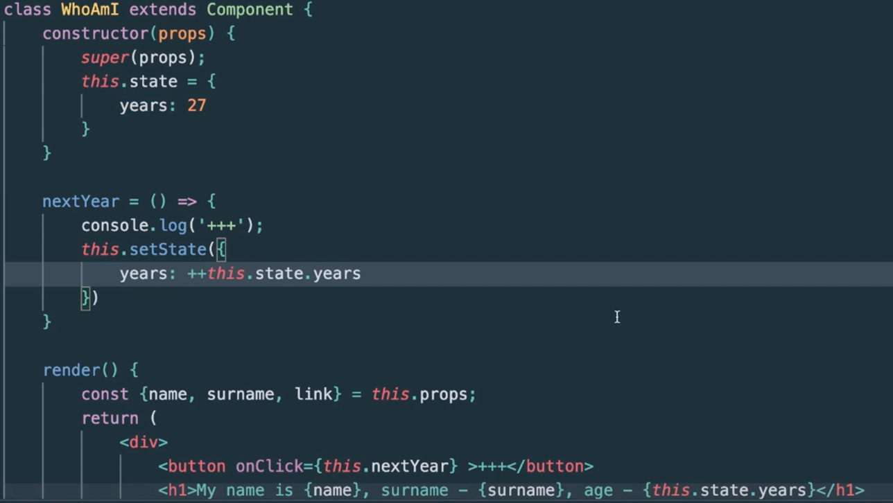
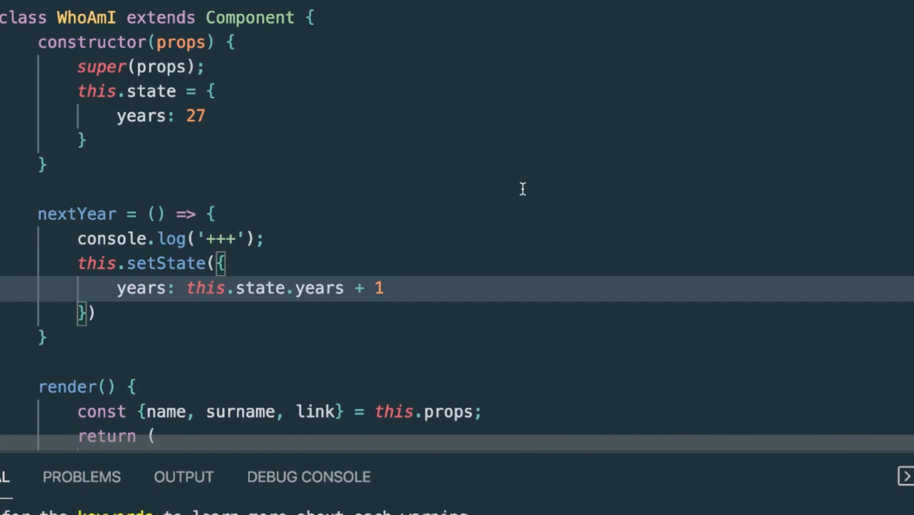
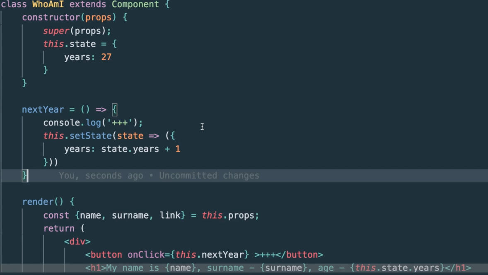

## Работа со списками и алгоритм согласования

***Алгоритм реконциляции (согласования, сверки)*** – при уничтожении или измении типа тега, то внутренняя структура уничтожается и заменяется – считается что проще уничтожить и создать заново все. Если меняются лишь атрибуты, то реакт будет обновлять лишь изменившиеся элементы.

Если нумерация добавления элементов в списках меняется, то перерисовывается все и страдает оптимизация – поэтому следует использовать атрибут(пропс) key

```
const data = [
    {name:"John C." , salary: 700, increase:true, id:1 },
    {name:"Alex M." , salary: 3000, increase:false, id:2 },
    {name:"Carl W." , salary: 5000, increase:false, id:3 },
  ];
const elements = data.map(item => {
        const {id, ...itemProps} = item;
        return (
            <EmployeesListItem key={id} {...itemProps}/>
            //<EmployeesListItem name={item.name} salary={item.salary}/>
        )
    });

```

Важно – идентификаторы могут быть идентичными вне списка, но внутри все должны отличаться!

---

Если бэк наложал, допускается использовать вместо айдишек индексы элементов.


---

Алгоритм согласования помогает реакту сравнивать элементы дум дерева и удалять старые добавляя новые видозмененные. Атрибут key использовать в одинаковых сущностях.

### Состояние компонентов
У каждого компонента есть динамическая часть (у счетчика число, у слайдера текущий слайд) – как раз таки эта часть называется состояние компонента – state


### Состояние классовых элементов
В конструктор приходит обьект пропс, куда передаем свойства командой super(props);


Но в данном случае лучше писать так: (так как мы наследуемся от класса компонент)



---

Изменение динамически данных в компоненте класса:
Важно помнить что пропсы лишь на чтение, и нарушать этот аспект нельзя.
Для изменения воспользуемся состоянием в конструкторе. Состояние это обьект, в который мы уже записываем новые данные:


Важно! Напрямую состояния изменять не можем! Перезаписывать тоже! Нужно использовать setState():


Но лучше инкрементировать так, ибо мы тем самым не изменяем предыдущее состояние.


Нюансы: setState выполняется асинхронно и может возникнуть ситуация что предыдущее состояние еще не обновилось – реакт изменяет состояния всех стейтов сразу все для оптимизации.

Решение проблемы, чтобы обьект состояния не сбивался – это :



Сет стейт не трогает другие не изменяющиеся свойства – так что важно лишь учитывать асинхронность.

Тогда
1)	У компонента может быть внутреннее динамически меняющееся
2)	Может быть состояние у классовых или функциональных компонентов
3)	State изменяется не напрямую
4)	Состояние это асинхронная операция
5)	Мы можем менять setState лишь те свойства, которые необходимы, остальные останутся без изменений

Код для работы с состояниями:

```
class App extends React.Component {
  constructor(props) {
    super(props);
    this.state = {
      counter: this.props.counter
    }
  }
  
  incCounter = () => {
    if (this.state.counter < 50) {
      this.setState(state => ({
        counter: state.counter + 1
      }))
    }
  }
  
  decCounter = () => {
    if (this.state.counter > -50) {
      this.setState(state => ({
        counter: state.counter - 1
      }))
    }
  }
  
  rndCounter = () => {
    this.setState({
      counter: +(Math.random() * (50 - -50) + -50).toFixed(0)
    })
  }
  
  resetCounter = () => {
    this.setState({
      counter: this.props.counter
    })
  }
  
  render() {
    const {counter} = this.state;
    
    return (
      <div className="app">
        <div className="counter">{counter}</div>
        <div className="controls">
          <button onClick={this.incCounter}>INC</button>
          <button onClick={this.decCounter}>DEC</button>
          <button onClick={this.rndCounter}>RND</button>
          <button onClick={this.resetCounter}>RESET</button>
        </div>
      </div>
    )
  }
}

ReactDOM.render(<App counter={0}/>, document.getElementById('app'));
```
